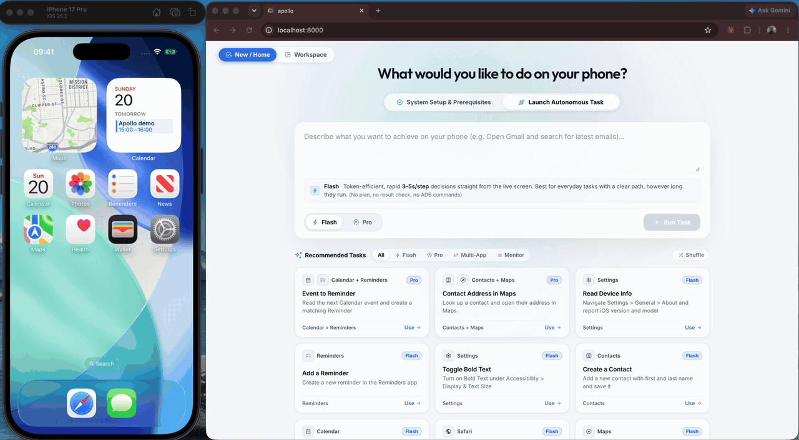

# Apollo

Apollo is an autonomous, natural-language iOS automation framework: a fork of
[Google Artemis](https://github.com/google/artemis) with the Android device layer replaced by
iOS Simulators and physical iPhones/iPads driven through WebDriverAgent, `xcrun simctl` and
`go-ios`.

<p align="center">
  
</p>

> **Status: Phase 2 in progress (simulator parity).** `apollo run`, the web console (`apollo ui`),
> `apollo doctor` and the MCP server (`apollo mcp --install claude`) all drive a booted iOS
> Simulator through WebDriverAgent, with recording, a 12 fps live view, alert policy, the Pro
> profile on 30-step cross-app tasks, `apollo runner`, the SDK and the raw device MCP server.
> `--app-path` on an iOSWorld app and physical devices (Phase 3) are next. See [`docs/development-plan.md`](docs/development-plan.md) for the roadmap and
> [`docs/technical-design.md`](docs/technical-design.md) for the design.

## Quick start

Requirements: macOS with Xcode 26.x and an iOS 26 simulator runtime, [`uv`](https://docs.astral.sh/uv/)
(Python 3.12 is pinned in `.python-version` and downloaded by `uv`), and an LLM API key.

```sh
git clone git@github.com:SVGreg/apollo.git && cd apollo
make install                              # uv sync --dev
cp .env.example .env                      # then set GOOGLE_API_KEY=… (default provider)
                                          # or ANTHROPIC_API_KEY=… / OPENAI_API_KEY=…
xcrun simctl list devices available | grep iPhone
xcrun simctl boot <udid>                  # e.g. "iPhone 17 Pro" (boots headless; keep Simulator.app open if you launch it)
```

Run a task:

```sh
uv run apollo run "Open Settings, go to General > About and tell me the iOS version" \
    --profile flash --standalone --device-serial <udid> --verification-level final
```

The first run downloads WebDriverAgent (pinned v16.12.9, checksum-verified), installs it on the
simulator and starts it; later runs reuse it. The Operator sees a screenshot plus the accessibility
tree of the foreground app and acts through taps, swipes, typing and app launches.

### Easy start: `./start.sh`

If you would rather not assemble the steps above, one script prepares the machine and opens the
web console:

```sh
./start.sh            # or: make start
```

What it does, in order: normalizes `PATH` for Homebrew/uv/Node; installs `uv` if missing; checks
for Xcode Command Line Tools and `simctl` (exits with instructions if absent) and warns about
optional tools (`ffmpeg`, `go-ios` — `make install-deps` adds them); copies `.env.example` to
`.env` if there is none; runs `uv sync`; builds the Angular console on first use (needs Node
≥ 22.22 — it tries nvm, Homebrew, then a portable Node in `~/.local`, so no admin rights are
required; the first build takes a few minutes and is skipped afterwards); asks whether to install
the MCP server + rules into your IDE agents (Claude Code, Cursor, Codex, Antigravity, …; answer
`n` to skip, `uv run apollo mcp --install all` does it later); then launches the console at
<http://localhost:8000> and opens your browser.

Things to know:

- **API key.** Put `GOOGLE_API_KEY=…` (default provider) or `ANTHROPIC_API_KEY=…` /
  `OPENAI_API_KEY=…` in `.env` before or after starting — the console's Setup Guide can also
  save a key for you. Without one the Run button stays disabled and `apollo doctor` says why.
- **Simulator.** Boot one from the console's device panel (or `xcrun simctl boot <udid>`
  beforehand). WebDriverAgent is downloaded and installed on the first task or the first time
  you open the live view. Don't quit Simulator.app while tasks run — it shuts every simulator down.
- **Arguments pass through** to `apollo ui`: `./start.sh --port 8080`, `./start.sh --no-open`.
- **Remote Macs.** Over SSH (or with no display) the browser isn't opened; the script prints the
  tunnel to use (`ssh -L 8000:localhost:8000 user@host`).
- **Stopping / restarting.** `Ctrl+C`, or from another terminal `uv run apollo stop` /
  `uv run apollo restart` / `uv run apollo status`. Re-running `./start.sh` is fast once the
  dependencies and UI build exist.
- **What it does not do.** It never touches Xcode itself, never asks for `sudo` on macOS, and
  does not boot a simulator or pick a model for you — those stay in the console and
  `config/apollo.jsonc`.

### Everyday commands

```sh
# Flash (fast, single loop) or Pro (Planner + Operator + Checker); final verification on
uv run apollo run "<goal>" --profile flash|pro --standalone --device-serial <udid> --verification-level final

# Test your own app: install a simulator build, keep the agent inside it
uv run apollo run "Log in as demo/demo and confirm the cart badge shows 2" \
    --app-path build/MyApp.app --locked-app com.acme.myapp --standalone --device-serial <udid>

# Regression list, one goal per line
uv run apollo batch --file tasks.txt --profile flash --standalone

# Inspect what happened (screenshots, hierarchy, actions, reasoning per step)
uv run apollo trace list
uv run apollo trace view <session>
```

Traces land in `traces/<session>_PASS|FAIL_<timestamp>/`.

### Choosing the model

Models live in `config/apollo.jsonc`. The default is `google/gemini-3.8-flash` (Gemini 3.5
Flash Lite for background summaries) with Anthropic Claude models as fallbacks, so a
`GOOGLE_API_KEY` alone runs everything. Presets:
`anthropic-opus`, `anthropic-sonnet`, `gemini-flagship`, `gemini-flash`, `openai-gpt4o`,
`cost-saving`, `local-ollama`. Switch for one run without editing the file:

```sh
APOLLO_LLM_PRESET=gemini-flagship uv run apollo run "…" --standalone --device-serial <udid>
```

Free-tier Gemini keys rate-limit long tasks (429 with 40–50 s retry delays); Claude keys have no
such issue in our runs.

### Web console, doctor and IDE agents

```sh
uv run apollo doctor                 # Xcode, simulators, WDA, keys, toolchain → "Ready"
uv run apollo ui                     # localhost:8000 — setup guide, device panel, task composer,
                                     # live screen, step replay, task queue
uv run apollo mcp --install claude   # registers mobile_run_task / mobile_manage_task /
                                     # mobile_inspect_trace / mobile_get_device_state / mobile_diagnose
                                     # (also: codex, cursor, antigravity, all)
uv run apollo runner status          # WebDriverAgent on the booted simulator: installed/answering/
                                     # version/ports; `install [--force]`, `stop`, `uninstall`
```

`mobile_diagnose(launch_avd="iPhone 17 Pro")` boots a simulator from the IDE; `xcrun simctl boot
<udid>` is the manual equivalent. Never quit Simulator.app while tasks run — it shuts every
simulator down.

### Without a key

```sh
make smoke-mock     # Flash loop against the in-memory mock driver with a fake LLM
make smoke-sim      # boots an iPhone simulator, provisions WDA, runs the driver smoke + a fake-LLM task
```

`make smoke-sim` is what CI runs on `macos-26` (`simulator-smoke` job); it needs Xcode with an
iOS runtime but no model key.

### Known limits (Phase 1a)

- Simulators only; physical devices arrive in Phase 3 (needs a signing-capable Apple account).
- The simulator's Settings has no Airplane Mode / Wi-Fi / Bluetooth / Cellular rows; ask for
  things the simulator has (General, Accessibility, Display, Calendar, Reminders, Contacts, Safari,
  Maps, Photos, Files, Messages). There is no Notes, Clock or Mail app on the iOS 26 runtime.
- Screen recording (`--with-video-recording-tools`, or `video_analyzer.enabled` in the config)
  writes `recording.mp4` into the trace. With `ffmpeg` installed it is encoded from the WDA MJPEG
  stream at a constant 12 fps (real-time timeline); without it, `simctl io recordVideo` is used
  (variable frame rate — static screens produce few frames). `APOLLO_IOS_RECORDING_BACKEND=
  auto|mjpeg|simctl` overrides. The ffmpeg path writes a fragmented MP4, so the Video Analyzer can
  cut segments out of a recording while the task is still running; the `simctl` path cannot (its
  file is finalized only when recording stops).
- System permission sheets: by default the Operator sees them as elements and taps them
  (`agent.ios.alerts: "observe"`); set `"accept"` or `"dismiss"` to have the driver answer them
  through WDA before each perception. `simctl privacy grant <service> <bundle id>` is available
  to the agent through `run_device_command` to pre-authorize instead.
- The console live view uses the WDA MJPEG server (~11 fps, half scale); opening it provisions
  the runner on the booted simulator if no task has it up, with `simctl` screenshot polling as
  the fallback.
- `run_adb_command` is replaced by an allowlisted `simctl` host command on iOS
  (`simctl openurl …`, `simctl listapps`, `simctl privacy grant …`); there is no on-device shell.

## Inherited from Artemis

Everything platform-neutral is reused unchanged and is documented upstream:

- Flash / Pro execution profiles (Planner, Operator, Checker, Explorer, Safety Net, history
  compression, verification levels).
- `apollo run | ui | mcp | doctor | batch | trace | server` CLI, `apollo-client` Python SDK,
  MCP tools `mobile_run_task`, `mobile_manage_task`, `mobile_get_device_state`,
  `mobile_inspect_trace`, `mobile_diagnose` for Claude Code / Codex / Cursor / Antigravity.
- Web console (FastAPI + Angular) with live screen, step replay and trace inspection.
- LLM provider matrix: Gemini, Vertex, OpenAI, Anthropic, OpenRouter, xAI, Ollama, vLLM, custom.


## Development

```sh
make install      # uv sync --dev
make lint         # ruff format --check + ruff check
make test         # hermetic unit suite (a placeholder GOOGLE_API_KEY is supplied)
uv run pyright --project pyright-core.json
```

Upstream tracking: [`docs/upstream-sync.md`](docs/upstream-sync.md). Phase 0 spike results:
[`docs/spikes.md`](docs/spikes.md). Target workflow (`apollo run` / `batch` / `ui` / `mcp`) and when each
lands: [`docs/development-plan.md#how-apollo-is-used`](docs/development-plan.md#how-apollo-is-used-target-workflow-same-as-artemis).

## License

[Apache License 2.0](LICENSE). Apollo is derived from Artemis (Copyright 2026 Google LLC), which
includes code from [Minitap, Inc.](https://github.com/minitap-ai/mobile-use); see [`NOTICE`](NOTICE).
